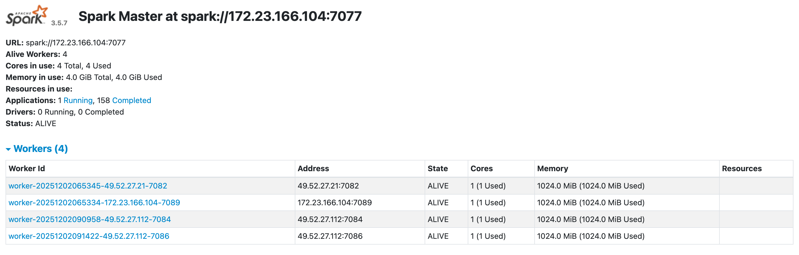
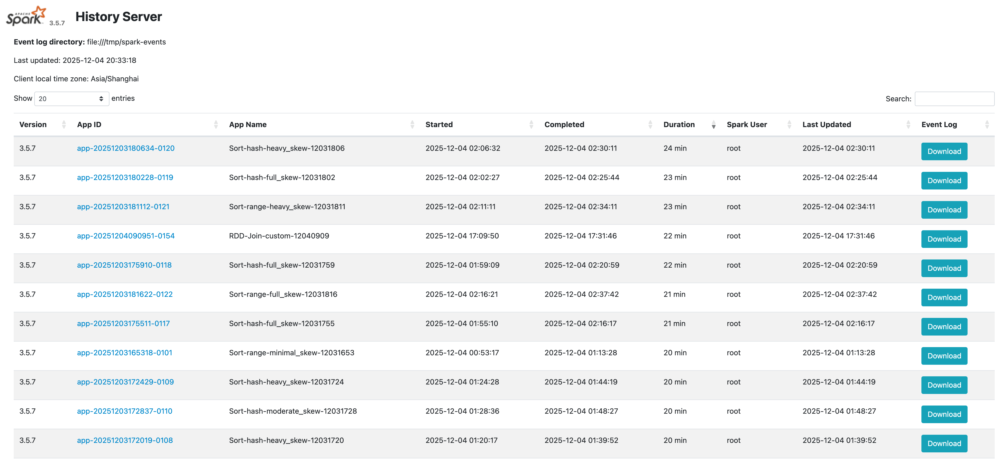
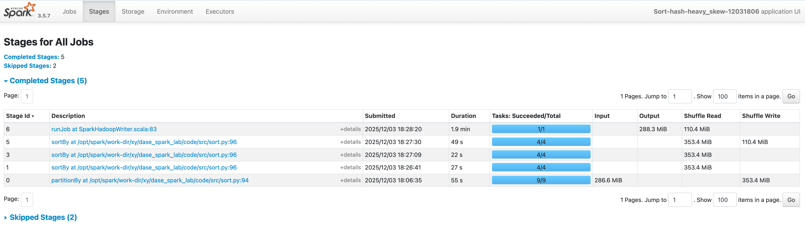
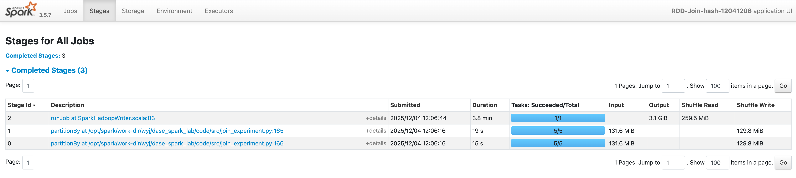
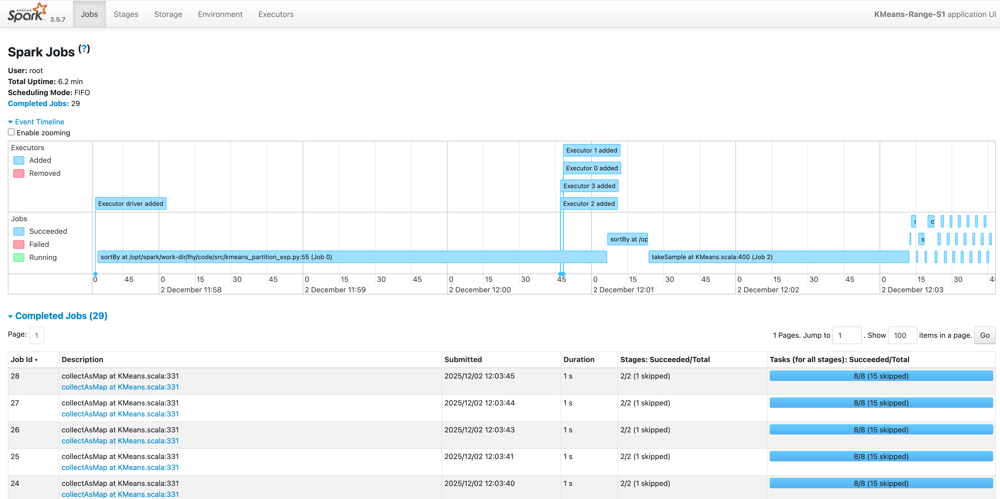
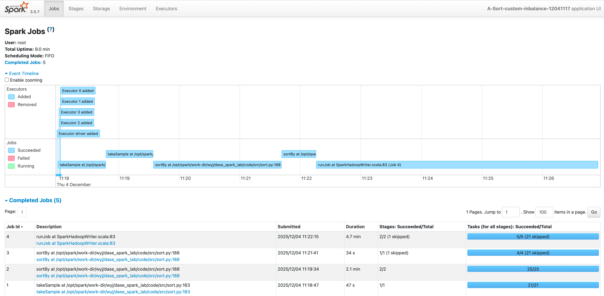

# Spark分区策略研究（第10组）

## **研究目的**

探究不同分区策略对Spark DAG调度与任务执行的影响。

## **研究内容**

深入理解Spark的DAG调度器，分析分区器（Partitioner）对 Stage 划分的影响。分析HashPartitioner、RangePartitioner以及自定义Partitioner的优缺点及适用场景。在不同的key分布（均匀分布与数据倾斜）下，研究如何通过调整分区策略来提升作业性能。

## 实验

### 实验环境

本次实验的集群配置使用了三个节点，其中包含一个Master进程，四个Worker进程。如下图所示。

所有实验在Docker容器中运行，三个节点的环境如下：

#### 172.23.166.104

##### 部署进程

spark-master，spark-worker，spark-history-server

**CPU 性能**

核数: 64，型号: Intel(R) Xeon(R) Gold 6226R CPU @ 2.90GHz

主频: 2900.000 MHz，架构: x86_64

**内存大小**: 754 GiB

**网络带宽**：1000Mb/s

**存储性能**：类型: HDD，写入速度: 3985.5 MB/s，读取速度: 38251.1 MB/s

#### 49.52.27.112

##### 部署进程

spark-worker，spark-worker

**CPU 性能**

核数: 64

型号: Intel(R) Xeon(R) Silver 4110 CPU @ 2.10GHz

主频: 2100.000 MHz

架构: x86_64

**内存大小**: 156 GiB

**网络带宽**：1000Mb/s

**存储性能**：类型: HDD，写入速度: 4876.2 MB/s，读取速度: 3103.0 MB/s

#### 49.52.27.21

部署进程：spark-worker-b4

**CPU 性能**

核数: 96

型号: Intel(R) Xeon(R) Gold 6240R CPU @ 2.40GHz

主频: 2400.000 MHz

架构: x86_64

**内存大小**: 754 GiB

**网络带宽**：1000Mb/s

**存储性能**：类型: HDD，写入速度: 5192.3 MB/s，读取速度: 37560.5 MB/s

##### 软件环境（Docker部署）

所有Spark节点都通过相同的docker镜像部署，软件环境一致

镜像：apache/spark:3.5.7-python3

系统版本：ubuntu20.04

JDK版本：JDK11

### 实验负载

本次实验选取了三种负载，包括

排序算法（基本负载）：`code/src/sort.py`

大表join（数据库负载）：`code/src/join_experiment.py`

k-means算法（机器学习负载）：`code/src/kmeans_partition_exp.py`

对于数据集，为了研究在不同倾斜度下的数据，我们使用了ZipF分布，并设置不同的倾斜参数s（s=0均匀，s=0.5中度倾斜，s=1重度倾斜）。实现位于`code/dataset`下

### 实验步骤

在不同倾斜度（ZipF分布中参数s=0，0.5，1）的数据集上分别采用多种分区策略（Hash，Range，Custom）。观察DAG的Stage划分，通过记录Shuffle数据量及作业执行时间等指标分析。

任务列表如下图所示，

排序任务如下图所示，

大表join任务如下图所示，

Kmeans任务如下图所示，

自定义分区器在排序中的应用如下图所示，

### 实验结果与分析

1. **不同负载和数据集下，使用三种分区器的相对运行时间：倾斜数据影响的直观表达**

   指标：相对运行时间 = 运行时间/baseline（当前负载在当前分区器均匀数据下的运行时间）

   现象：运行时间均匀 < 中度倾斜 < 重度倾斜

2. **不同负载的倾斜情况（s=1，0.5）下每个节点的相对Shuffle数据量（极端情况）：明确倾斜数据影响的原因来源于出现了大工作量的节点**

   指标：相对Shuffle数据量（极端情况） = max(每个节点的Shufflle read)/baseline（当前负载在当前分区器均匀数据下节点Shufflle read的中位数）

   现象：在面对倾斜数据时，使用range分区器的不同分区数据量分布更均匀

   原因：hash分区器分区时未考虑key分布，只是计算hash函数。然而range分区器采样时可以获得整体的分布情况，而不会将过多数据分入同一分区

3. **不同负载的均匀情况（s=0）下，使用三种分区器的相对运行时间：判断在均匀情况下使用哪种分区器效率最高**

   指标：相对运行时间 = 运行时间/baseline（当前负载在hash分区器均匀数据下的运行时间）

   现象：对于均匀数据，使用range分区的运行时间 > 使用hash分区的运行时间

   原因：对于均匀数据，hash和range分的区都很均匀，但range有一个采样stage耗时。

### 实验结论

1. **对于均匀数据，使用HashPartitioner的运行时间更短**。因为每个分区数据量基本一致，但RangePartitioner的采样过程较为耗时。
2. **对于倾斜数据，使用RangePartitioner的运行时间更短**。因为RangePartitioner在采样时获取了数据分布，分区数据量较HashPartitioner更加均匀，分区的数据量最大值更小，如果一个分区分到了过多倾斜数据，则不会再给其分其他数据。但HashPartitioner分区时未考虑到数据分布，只是计算哈希值，可能导致一个分区分到过于多的数据，成为集群的瓶颈。而且对于大数据量任务时，RangePartitioner分区引入的采样时间远小于HashPartitioner带来的分区大小的巨大差别。

### 文件结构 
src: 项目源代码

env： 环境部署（docker）

dataset： 负载数据集

### 小组分工

徐越：倾斜数据定义与实现，评估指标定义，集群环境部署，排序负载实现，演示视频制作

刘昊阳：Kmeans负载实现，调研不同数据量大小对结果的影响，PPT制作（实验结果展示与分析部分）

吴英杰：集群环境部署，自定义分区器实现，PPT制作（实验结果展示与分析部分）

梁孝强：大表join负载实现，PPT制作（研究背景，分区器原理，实验准备部分）